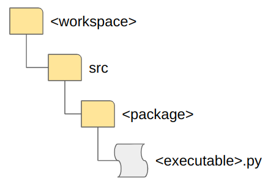

# ros2_trial
## Standard workflow
### python pkg w/o specified node (publisher)

1. mkdir \<workspace\>
1. cd \<workspace\>
1. colcon --build
1. mkdir src
1. cd src
1. ros2 pkg create --build-type ament_python \<pkg name\>
1. cd \<pkg name\>
1. touch \<fname\>.py
1. edit \<fname\>.py
1. cd ../..
1. colcon build --packages-select \<pkg name\> // build specified package solely.
1. source install/local_setup.zsh
1. ros2 run \<pkg name\> \<executable name\>
````
    entry_points={
        'console_scripts': [
	    'pub = my_ros2_pkg.my_ros2_pkg_pub:main',
        ],   ^^^1  ^^^^^^^^^^2 ^^^^^^^^^^^^^^3 ^^^4
    },
    
1: executable name
2: pkg name
3: fname
4: function name
````

Additional: subscriber

### python pkg w/ specified node (publisher)
same as above except "ros2 pkg create"
1. ros2 pkg create --build-type ament_python --node-name \<node name\> \<pkg name\>
source file to implement node is created automatically.

